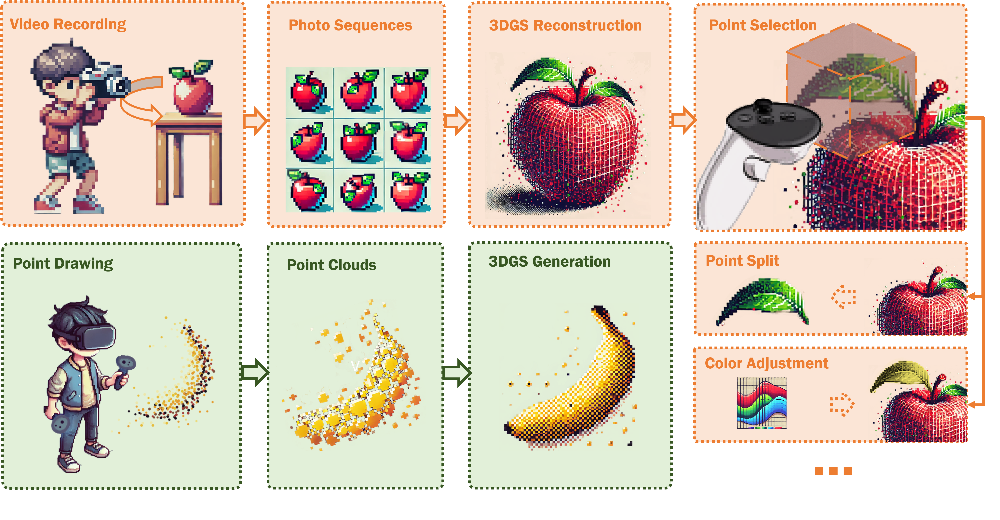

# GaussianShopVR: Facilitating Immersive 3D Authoring Using Gaussian Splatting in VR

<h4 align="center">

[](https://cislab.hkust-gz.edu.cn/projects/gaussianshopvr/)
[](https://cislab.hkust-gz.edu.cn/projects/gaussianshopvr/static/poster.pdf)

<p>
    
</p>
</h4>

Code coming soon.

## Citation
If you find our work helpful, please consider citing:
```bibtex
@inproceedings{shen2025GaussianShopVR,
    author = {Shen, Yulin and Li, Boyu and Huang, Jiayang and Yip, David and Wang, Zeyu},
    title = {GaussianShopVR: Facilitating Immersive 3D Authoring Using Gaussian Splatting in VR},
    year = {2025},
    isbn = {9798400720376},
    publisher = {Association for Computing Machinery},
    address = {New York, NY, USA},
    url = {https://doi.org/10.1145/3746059.3747803},
    doi = {10.1145/3746059.3747803},
    booktitle = {Proceedings of the 38th Annual ACM Symposium on User Interface Software and Technology},
}
```